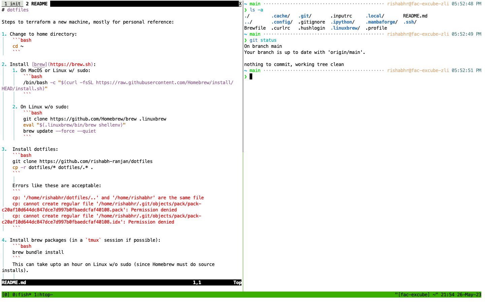

# dotfiles

Steps to terraform a new machine, mostly for personal reference:

1. Change to home directory:
	```bash
	cd ~
	```

2. Install [brew](https://brew.sh):
	1. On MacOS or Linux w/ sudo:
		```bash
		/bin/bash -c "$(curl -fsSL https://raw.githubusercontent.com/Homebrew/install/HEAD/install.sh)"
		```

	2. On Linux w/o sudo:
		```bash
		git clone https://github.com/Homebrew/brew .linuxbrew
		eval "$(.linuxbrew/bin/brew shellenv)"
		brew update --force --quiet
		```

3.  Install dotfiles:
	```bash
	git clone https://github.com/rishabh-ranjan/dotfiles
	cp -r dotfiles/* dotfiles/.* .
	```

	Errors like these are acceptable:
	```
	cp: '/home/rishabhr/dotfiles/..' and '/home/rishabhr' are the same file
	cp: cannot create regular file '/home/rishabhr/.git/objects/pack/pack-c20af10d644dc847dce7d997b0fbaedcfaf40108.pack': Permission denied
	cp: cannot create regular file '/home/rishabhr/.git/objects/pack/pack-c20af10d644dc847dce7d997b0fbaedcfaf40108.idx': Permission denied
	```

4. Install brew packages (in a `tmux` session if possible):
	```bash
	brew bundle install
	```
	This can take upto an hour on Linux w/o sudo (since Homebrew must do source installs).

	If neovim fails to install, try:
	```bash
	brew uninstall neovim
	brew uninstall --force libvterm
	brew install neovim --head
	```

5. At this point, we can ssh into the machine again. As per the message, setup prompt:
	```bash
	fisher install IlanCosman/tide@v5
	echo 1 1 3 2 2 1 1 1 y | tide configure > /dev/null
	```
	Select `n` in `Configure tide prompt? [Y/n]`. The second line will configure prompt automatically.

	Login again for the prompt to take effect.

6. Install [mambaforge](https://github.com/conda-forge/miniforge#mambaforge):
	```bash
	aria2c https://github.com/conda-forge/miniforge/releases/latest/download/Mambaforge-Linux-x86_64.sh # for linux
	chmod +x Mambaforge-Linux-x86_64.sh
	echo -e "\nyes\n~/.mambaforge\nno" | ./Mambaforge-Linux-x86_64.sh
	```
	Use 'q' to exit the license.

7. Clean up home directory:
	```bash
	rm -rf .bash_history .bash_logout .bashrc .cache .conda dotfiles Mambaforge-Linux-x86_64.sh
	ls -a
	```

8. Add ssh-key with:
	```bash
	ssh-copy-id <username>@<hostname>
	```

9. If required, add a custom rc for fish at `~/.config/fish/custom/<name>.fish` and link to it (or one of the existing ones) with:
	```bash
	ln -s ~/.config/fish/custom/<name>.fish ~/.config/fish/custom.fish
	```

10. Neovim should install plugins and do other setup automatically on first run:
	```bash
	nvim
	```
	Might give error on the first run because `plug.vim` is not recognized yet, but simply quitting and rerunning `nvim` fixes this.

---

My setup looks something like this:


